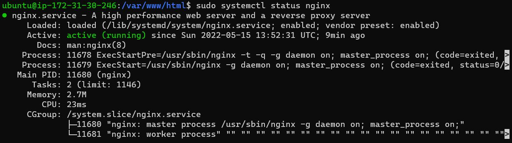
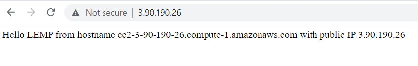
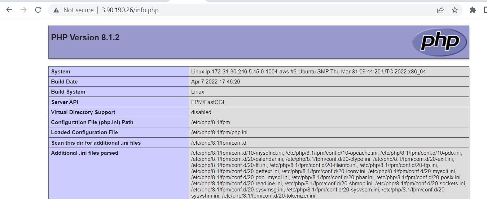
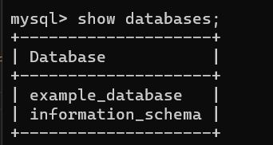
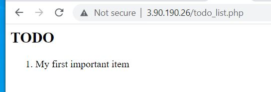

### PROJECT 2

#Install NGINX web server

`sudo apt install nginx`



## Mysql Server is already installed in project-1

## Install PHP fast cgi process manager 

`sudo apt install php-fpm php-mysql`

## Configure NGINX to use the PHP processor

`sudo mkdir /var/www/projectLEMP`

## Create a root web directory my doman

`sudo mkdir /var/www/projectLEMP`

## Change ownership

`sudo chown -R $USER:$USER /var/www/projectLEMP`

## Create new configuration file for NGINX

`sudo nano /etc/nginx/sites-available/projectLEMP`

`#/etc/nginx/sites-available/projectLEMP

server {
    listen 80;
    server_name projectLEMP www.projectLEMP;
    root /var/www/projectLEMP;

    index index.html index.htm index.php;

    location / {
        try_files $uri $uri/ =404;
    }

    location ~ \.php$ {
        include snippets/fastcgi-php.conf;
        fastcgi_pass unix:/var/run/php/php8.1-fpm.sock;
     }

    location ~ /\.ht {
        deny all;
    }

}`


## Activate the configuration 

`sudo ln -s /etc/nginx/sites-available/projectLEMP /etc/nginx/sites-enabled/`

## Disable the default NGINX host configured to listen on port 80

`sudo unlink /etc/nginx/sites-enabled/default`

## Reload NGINX

`sudo systemctl reload nginx`

## Create a temporary page

`sudo echo 'Hello LEMP from hostname' $(curl -s http://169.254.169.254/latest/meta-data/public-hostname) 'with public IP' $(curl -s http://169.254.169.254/latest/meta-data/public-ipv4) > /var/www/projectLEMP/index.html`




### Testing PHP with NGINX

`sudo nano /var/www/projectLEMP/info.php`

```
<?php
phpinfo();
```




### Retrieve data from mysql Database with PHP

## Connect to the database

`sudo mysql -p`

# Create a database

`CREATE DATABASE example_database;`


`CREATE USER 'example_user'@'%' IDENTIFIED WITH mysql_native_password BY 'password';`

`GRANT ALL ON example_database.* TO 'example_user'@'%';`

`SHOW DATABASES;`


```
CREATE TABLE example_database.todo_list (
  item_id INT AUTO_INCREMENT,
  content VARCHAR(255),
  PRIMARY KEY(item_id)
);
```
`INSERT INTO example_database.todo_list (content) VALUES ("My first important item");`

`SELECT * FROM example_database.todo_list;`


## Connect PHP to Mysql

```
<?php
$user = "example_user";
$password = "password";
$database = "example_database";
$table = "todo_list";

try {
  $db = new PDO("mysql:host=localhost;dbname=$database", $user, $password);
  echo "<h2>TODO</h2><ol>";
  foreach($db->query("SELECT content FROM $table") as $row) {
    echo "<li>" . $row['content'] . "</li>";
  }
  echo "</ol>";
} catch (PDOException $e) {
    print "Error!: " . $e->getMessage() . "<br/>";
    die();
}
```

# check on the url



